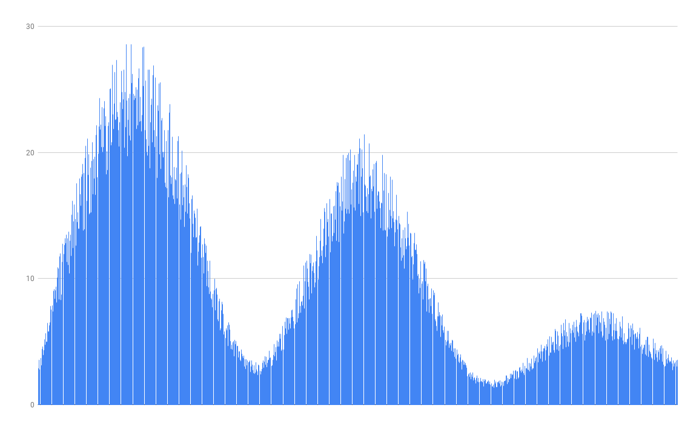

# Limited Randoms Generator

Generate random numbers:

- that sum up to a provided *total sum*,
- with provided *precision*,
- in a range <limit - 20% * limit; limit + 20% * limit),
  - there might be multiple limits,
  - numbers need to be split evenly within limits,
  - limit needs to be treated as a weight (and not an absolute value),
- matching a limit sharply (hard limit type) or smoothly (interpolated limit type).

## Sharp limit

- total sum: 10000 
- number of values: 1000 
- precision: 2 
- limits: 1;8;1;6;1;2;1 
- limit type: SHARP_LIMIT

```
mvn clean install
java -jar .\target\limitedrandoms-0.0.1-SNAPSHOT-jar-with-dependencies.jar 10000 1000 2 1;8;1;6;1;2;1 SHARP_LIMIT
```


## Smooth limit

- total sum: 10000 
- number of values: 1000 
- precision: 2 
- limits: 1;8;1;6;1;2;1 
- limit type: SMOOTH_LIMIT 

```
mvn clean install
java -jar .\target\limitedrandoms-0.0.1-SNAPSHOT-jar-with-dependencies.jar 10000 1000 2 1;8;1;6;1;2;1 SMOOTH_LIMIT
```

